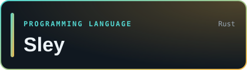
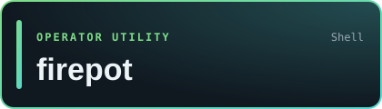
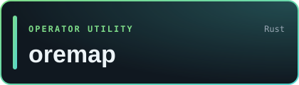
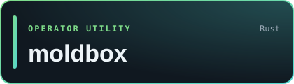
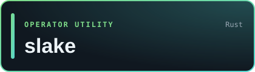
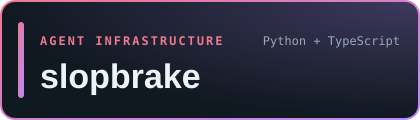
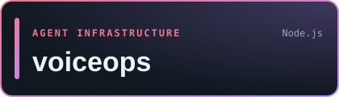

<!-- generated by scripts/generate_catalog.py; edit catalog.json instead -->

  

<b>Greyforge Labs builds Sley, a machine-native programming language for AI agents, and open-source tools for Omarchy desktops, self-hosted operations, and agent infrastructure.</b>

## Sley: machine-native programming for AI agents

<table>
<tr>
<td width="42%" valign="middle">

</td>
<td valign="middle">

A machine-native programming language for AI agents. A Sley program is a typed, content-addressed semantic graph rather than source text. Agents read it through bounded queries and change it with typed mutations, and a deterministic kernel checks every change before an atomic commit.

<a href="https://github.com/sley-lang/sley"><b>Source</b></a> · <a href="https://github.com/sley-lang"><b>sley-lang on GitHub</b></a> · <a href="https://github.com/sley-lang/sley/releases"><b>Releases</b></a> · <a href="https://github.com/sley-lang/sley/blob/main/docs/QUICKSTART.md"><b>Quickstart</b></a>

 

</td>
</tr>
</table>

## Omarchy desktop tools

Plugins and window tools for [Omarchy](https://omarchy.org), the Hyprland-based Arch Linux setup.

<table>
<tr>
<td width="33%" valign="top">

CPU, RAM, Internet, Storage in the Omarchy bar; a 5 KB native monitor with configurable metrics and refresh intervals.

 <a href="https://github.com/GreyforgeLabs/omarchy-cris#readme">Docs</a>

</td>
<td width="33%" valign="top">

Makes Super+W on Omarchy hide the window instead of killing it, so one keystroke brings it back exactly as it was.

 <a href="https://github.com/GreyforgeLabs/reprieve#readme">Docs</a>

</td>
<td width="33%" valign="top">

Omarchy bar plugin with fixed app slots, filesystem Places, and one bounded Running drawer.

 <a href="https://github.com/GreyforgeLabs/omarchy-hotbar#readme">Docs</a>

</td>
</tr>
<tr>
<td width="33%" valign="top">

Mouse-driven window controls for Omarchy: minimize, maximize, close, and move, and every minimized window keeps a way back.

 <a href="https://github.com/GreyforgeLabs/omarchy-grabbar#readme">Docs</a>

</td>
</tr>
</table>

## Operator utilities

Small tools for people who run their own Linux hosts, scheduled jobs, and services. [devcap](https://github.com/GreyforgeLabs/devcap) remains available for existing users in maintenance-only status.

<table>
<tr>
<td width="50%" valign="top">

One Bash script for Linux host checks and SSH fleet reports; configured checks fail visibly when probes or mounts are unavailable.

 <a href="https://github.com/GreyforgeLabs/firepot#readme">Docs</a>

</td>
<td width="50%" valign="top">

Inventories services, cron jobs, wrappers, repos, and env-file metadata; incomplete scans and retirement suggestions stay explicit.

 <a href="https://github.com/GreyforgeLabs/oremap#readme">Docs</a>

</td>
</tr>
<tr>
<td width="50%" valign="top">

Rust CLI and library for SQLite online backups and WAL checkpoint reports, with complete-snapshot gating and restore guidance.

 <a href="https://github.com/GreyforgeLabs/moldbox#readme">Docs</a>

</td>
<td width="50%" valign="top">

SQLite-backed cooldown and retry gate for recurring commands, with active-claim protection on clear and documented lease limits.

 <a href="https://github.com/GreyforgeLabs/slake#readme">Docs</a>

</td>
</tr>
<tr>
<td width="50%" valign="top">

Atomic, cross-process locked, schema-versioned JSON persistence as a Rust library and CLI; read-only metadata inspection has no file side effects.

 <a href="https://github.com/GreyforgeLabs/tongs#readme">Docs</a>

</td>
</tr>
</table>

## Agent infrastructure

Building blocks for AI agent systems.

<table>
<tr>
<td width="50%" valign="top">

MIT-licensed brakes for coding agents: catch tautological tests, commit review fixes, and hold one-way changes for a human.

 <a href="https://greyforge.tech/chronicles/slopbrake-brakes-for-the-software-factory">Docs</a>

</td>
<td width="50%" valign="top">

Scores agent memory candidates with deterministic heuristics, not an LLM judge, before they reach long-term storage.

 <a href="https://github.com/GreyforgeLabs/memory-quality-gate#readme">Docs</a>

</td>
</tr>
<tr>
<td width="50%" valign="top">

Full-duplex Discord voice loop for agent gateways.

 <a href="https://github.com/GreyforgeLabs/voiceops#readme">Docs</a>

</td>
</tr>
</table>

## Historical Projects

Finished or retired work, kept public for reference.

| Project | Stack | Status |
|---|---|---|
| [sley-legacy](https://github.com/GreyforgeLabs/sley-legacy) · [Docs](https://github.com/GreyforgeLabs/sley-legacy#readme) | Shell | Sley 1.2 legacy lineage: the completed, frozen human-readable predecessor of Sley 2, kept for history and existing users |
| [pcam](https://github.com/GreyforgeLabs/pcam) · [Docs](https://github.com/GreyforgeLabs/pcam#readme) | Spec | Retired archival draft; final published candidate `v3.0.0-draft.1`; no conformance class claimed |
| [geminibot](https://github.com/GreyforgeLabs/geminibot) · [Docs](https://github.com/GreyforgeLabs/geminibot#readme) | Node.js | Archived Telegram assistant bridge; historical reference only, with no further releases, dependency updates, or security fixes planned |

Records: [CRIS announcement on X](https://x.com/GreyforgeLabs/status/2104939023513145412) · [Sley releases](https://github.com/sley-lang/sley/releases) · [Sley 1.2.1 legacy source tag](https://github.com/GreyforgeLabs/sley-legacy/tree/v1.2.1) · [PCAM retired-draft status](https://github.com/GreyforgeLabs/pcam/blob/main/STATUS.md)

Built by [Greyforge Labs](https://greyforge.tech/about). License and authorship notices live in each repository.

**Autonomy, Engineered.**

