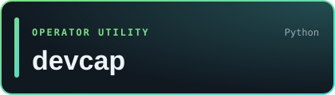
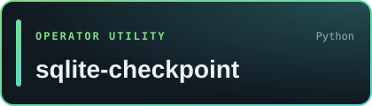
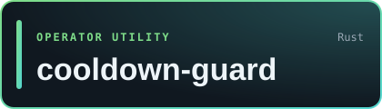
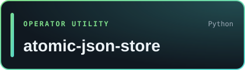

<!-- generated by scripts/generate_catalog.py; edit catalog.json instead -->

   

<b>Greyforge Labs builds Sley, a machine-native programming language for AI agents, and open-source tools for Omarchy desktops, self-hosted operations, and agent infrastructure.</b>

## Sley: machine-native programming for AI agents

<table>
<tr>
<td width="42%" valign="middle">

</td>
<td valign="middle">

A machine-native programming language for AI agents. A Sley program is a typed, content-addressed semantic graph rather than source text. Agents read it through bounded queries and change it with typed mutations, and a deterministic kernel checks every change before an atomic commit.

<a href="https://github.com/sley-lang/sley"><b>Source</b></a> · <a href="https://sleylang.org"><b>sleylang.org</b></a> · <a href="https://github.com/sley-lang"><b>sley-lang on GitHub</b></a> · <a href="https://github.com/sley-lang/sley/releases"><b>Releases</b></a>

 

</td>
</tr>
</table>

## Omarchy desktop tools

Plugins and window tools for [Omarchy](https://omarchy.org), the Hyprland-based Arch Linux setup.

<table>
<tr>
<td width="33%" valign="top">

Makes Super+W on Omarchy hide the window instead of killing it, so one keystroke brings it back exactly as it was.

 <a href="https://github.com/GreyforgeLabs/reprieve#readme">Docs</a>

</td>
<td width="33%" valign="top">

Omarchy bar plugin with fixed app slots, filesystem Places, and one bounded Running drawer.

 <a href="https://github.com/GreyforgeLabs/omarchy-hotbar#readme">Docs</a>

</td>
<td width="33%" valign="top">

Mouse-driven window controls for Omarchy: minimize, maximize, close, and move, and every minimized window keeps a way back.

 <a href="https://github.com/GreyforgeLabs/omarchy-grabbar#readme">Docs</a>

</td>
</tr>
</table>

## Operator utilities

Small tools for people who run their own Linux hosts, scheduled jobs, and services.

<table>
<tr>
<td width="50%" valign="top">

One Bash script that runs Linux host health checks with JSON output, 0/1/2 exit codes, and multi-node SSH aggregation.

 <a href="https://github.com/GreyforgeLabs/node-healthcheck#readme">Docs</a>

</td>
<td width="50%" valign="top">

Builds a read-only keep, review, and retire matrix for services, cron jobs, wrappers, repos, and env-file metadata.

 <a href="https://github.com/GreyforgeLabs/service-cartographer#readme">Docs</a>

</td>
</tr>
<tr>
<td width="50%" valign="top">

Scans a machine for installed developer tools and reports versions, paths, and what is missing as text, JSON, or Markdown.

 <a href="https://github.com/GreyforgeLabs/devcap#readme">Docs</a>

</td>
<td width="50%" valign="top">

CLI and Python library for SQLite WAL checkpoints, online backups, and snapshots, with no dependencies beyond the standard library.

 <a href="https://github.com/GreyforgeLabs/sqlite-checkpoint#readme">Docs</a>

</td>
</tr>
<tr>
<td width="50%" valign="top">

SQLite-backed cooldown and retry gate that enforces minimum intervals for cron jobs, recurring commands, and repair loops.

 <a href="https://github.com/GreyforgeLabs/cooldown-guard#readme">Docs</a>

</td>
<td width="50%" valign="top">

Atomic, cross-process locked, schema-versioned JSON persistence for Python with zero dependencies.

 <a href="https://github.com/GreyforgeLabs/atomic-json-store#readme">Docs</a>

</td>
</tr>
</table>

## Agent infrastructure

Building blocks for AI agent systems.

<table>
<tr>
<td width="50%" valign="top">

Scores agent memory candidates with deterministic heuristics, not an LLM judge, before they reach long-term storage.

 <a href="https://github.com/GreyforgeLabs/memory-quality-gate#readme">Docs</a>

</td>
<td width="50%" valign="top">

Full-duplex Discord voice loop for agent gateways.

 <a href="https://github.com/GreyforgeLabs/voiceops#readme">Docs</a>

</td>
</tr>
</table>

## Historical Projects

Finished or retired work, kept public for reference.

| Project | Stack | Status |
|---|---|---|
| [sley-legacy](https://github.com/GreyforgeLabs/sley-legacy) · [Docs](https://github.com/GreyforgeLabs/sley-legacy#readme) | Shell | Sley 1.2 legacy lineage: the completed, frozen human-readable predecessor of Sley 2, kept for history and existing users |
| [pcam](https://github.com/GreyforgeLabs/pcam) · [Docs](https://github.com/GreyforgeLabs/pcam#readme) | Spec | Retired archival draft; final published candidate `v3.0.0-draft.1`; no conformance class claimed |
| [geminibot](https://github.com/GreyforgeLabs/geminibot) · [Docs](https://github.com/GreyforgeLabs/geminibot#readme) | Node.js | Archived Telegram assistant bridge; historical reference only, with no further releases, dependency updates, or security fixes planned |

Records: [Sley releases](https://github.com/sley-lang/sley/releases) · [Sley 1.2.1 legacy source tag](https://github.com/GreyforgeLabs/sley-legacy/tree/v1.2.1) · [PCAM retired-draft status](https://github.com/GreyforgeLabs/pcam/blob/main/STATUS.md)

Built by [Greyforge Labs](https://greyforge.tech/about). License and authorship notices live in each repository.

**Autonomy, Engineered.**

